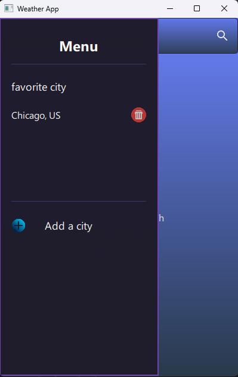

# Application Météo  

**Une application météo simple en C++ et QML démontrant l'utilisation de Qt pour interagir avec des API REST.**  

Cette application a été développée dans le cadre d'un apprentissage personnel. Elle répondait parfaitement aux exigences, permettant de rechercher une ville et d'obtenir des prévisions météorologiques (plus ou moins précises).  

---
## 🌟 Fonctionnalités  

### 📍 Au démarrage de l'application :  
- Vous devez appuyer sur l'icône de recherche dans la barre de navigation pour effectuer une **recherche manuelle** d'un emplacement.  
- 1. Choisissez un pays.  
- 2. Entrez le code postal de la ville souhaitée.  

### 🔍 Recherche d'un emplacement spécifique :  
- En raison des **limitations de l'API**, certaines petites localités peuvent ne pas être disponibles.  
- Il peut être nécessaire d’essayer un **lieu plus grand** à proximité pour obtenir une prévision approximative.  

### ⛅ Prévisions météorologiques :  
- **Conditions actuelles** :  
  - Description, température, humidité, vent, précipitations.  

### ⭐ Favoris :  
- Enregistrez un **emplacement favori** pour un accès rapide.  
- Accédez-y via le **tiroir latéral** (balayez depuis le bord gauche de l'écran).  

### 🌍 Support linguistique :  
- Actuellement disponible en **anglais**.  

---

🚀 **Prêt à explorer la météo avec Qt ?**  

---
